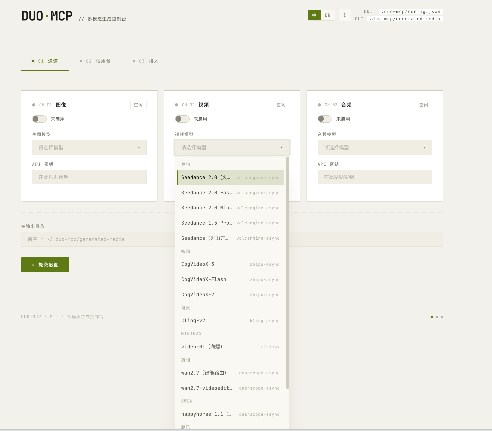
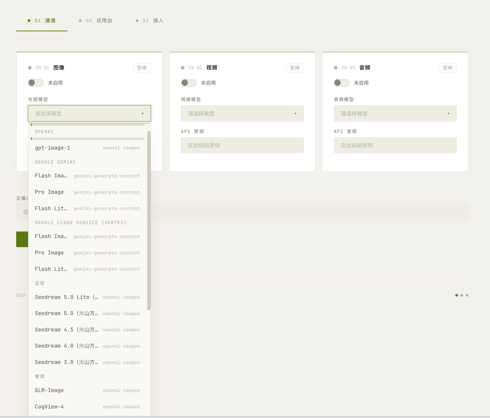
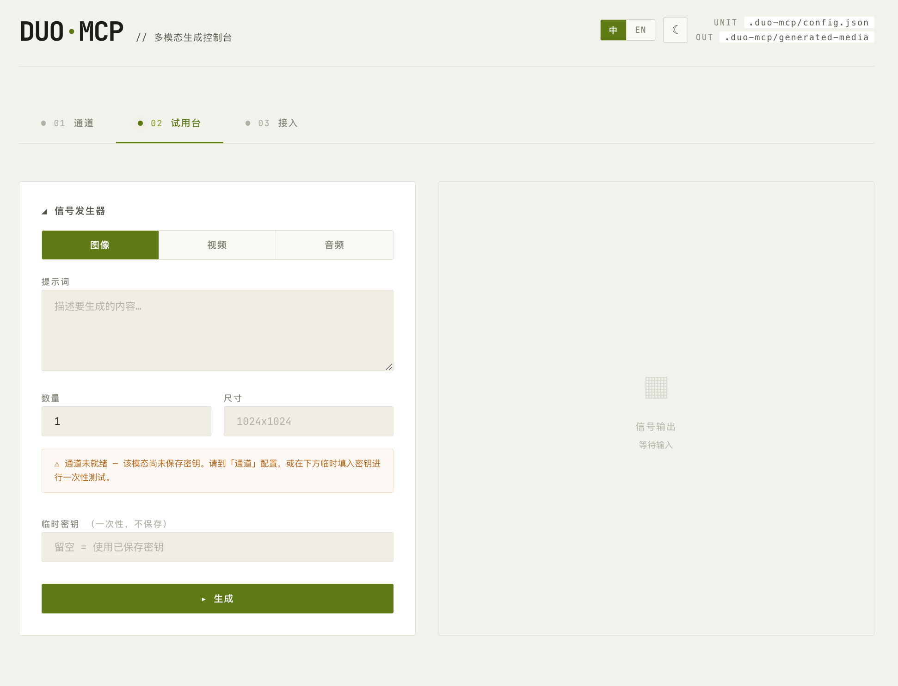
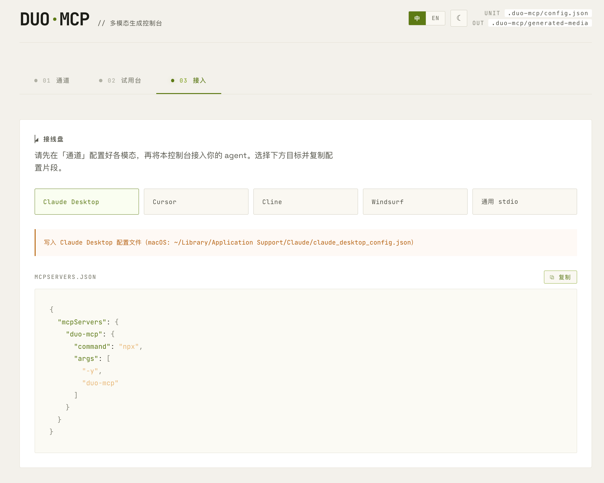

<div align="center">

# Prismstudio

**A standalone multimodal generation MCP Server** — one command, let any AI agent generate images / video / audio

`Image · Video · Audio` · `60 preset models` · `14 protocols` · `13 vendors` · `Built-in WebUI`

[](LICENSE)
[](package.json)
[](https://www.npmjs.com/package/prismstudio)
[](https://github.com/RunhuaHuang/prismstudio/actions/workflows/ci.yml)

[简体中文](README.md) ｜ **English**

</div>

<p align="center">
  
</p>

---

Prismstudio is a standalone service that follows the [Model Context Protocol](https://modelcontextprotocol.io). It lets any MCP-compatible AI agent (Claude Desktop, Cursor, Cline, Windsurf, VS Code, …) directly call **dozens of mainstream multimodal models** to generate images, video, and audio — without integrating each provider's API yourself.

It solves the "configuration is annoying" problem with a **built-in WebUI**: one command opens a browser where you pick a model, fill in your key, try it out, and copy-paste the wiring config — as easy as a desktop app.

## Key highlights

<table>
<tr>
<td width="50%" valign="top">

### Mainstream models — nearly all covered

**60 preset models · 13 vendors**, China + international in one go:

**🖼️ Image** · OpenAI gpt-image · Google Gemini (nano-banana) / Vertex · Doubao Seedream · Zhipu GLM-Image / CogView · Tongyi Qwen-Image · Wanxiang · Stability · Tencent Hunyuan · MiniMax · Midjourney

**🎬 Video** · Google Veo 3.1 · Zhipu CogVideoX · Doubao Seedance · Kling · MiniMax · Wanxiang wan2.7 · Qwen HappyHorse · Tencent Hunyuan

**🔊 Audio** · CosyVoice · Qwen3-TTS · Zhipu GLM-TTS · MiniMax speech/music · Voice cloning

New model? Just add a preset — the engine auto-dispatches across 14 protocol families.

</td>
<td width="50%" valign="top">

### One MCP, any agent

Built on the open MCP standard — **any local agent that supports MCP works out of the box**:

- **Claude Desktop**
- **Cursor**
- **Cline**
- **Windsurf**
- **VS Code (Copilot Chat)**
- … and any stdio MCP client

Zero-code wiring: the WebUI wizard copies a `mcpServers` JSON snippet in one click — paste it into your agent and you're done. **Configure once, use everywhere.**

</td>
</tr>
</table>

### And more

- **Full multimodal coverage**: text-to-image, image editing, text-to-video, image-to-video, TTS, music generation, voice cloning
- **Built-in WebUI**: config console + playground + wiring wizard in one — zero config, no hand-written JSON
- **Dynamic tool exposure**: only configured modalities expose their tool — no dead-shell tools
- **Local-first**: credentials stored in plaintext at `~/.prismstudio/config.json`, WebUI binds only to `127.0.0.1`, nothing is ever uploaded

---

## Capabilities

Prismstudio encapsulates each `modality × vendor` pair into one of 14 protocol families; the engine core dispatches to the right provider based on your config. **60 preset models** in total:

### Image generation (28 models · text-to-image · image-to-image · editing)

| Vendor | Models | Capabilities |
|---|---|---|
| OpenAI | gpt-image-1 / 2 | T2I, reference-image editing, transparent background |
| Google Gemini | flash / flash-lite / pro (nano-banana) | T2I, multi-turn editing, aspect ratio & resolution |
| Google Vertex | flash / flash-lite / pro | Same as Gemini, via Vertex AI quota |
| Doubao | Seedream (4 / 4.5 / 5 / 5-Lite) | High-quality Chinese images |
| Zhipu | GLM-Image, CogView-4 | Chinese open-source ecosystem |
| MiniMax | image-01 | Single-image generation |
| Tongyi Wanxiang | Qwen-Image, Plus / Max / 2-Pro | Alibaba Cloud images |
| Wanxiang | wanx-2.1-turbo / plus | Cost-effective |
| Stability | SDXL / SD3 / Ultra | Classic Stable Diffusion |
| Tencent | Hunyuan image v3 / lite | Tencent Cloud images |
| Midjourney | midjourney | Stylized generation |

### Video generation (19 models · text-to-video · image-to-video · async)

| Vendor | Models | Capabilities |
|---|---|---|
| Zhipu | CogVideoX 2 / 3 / Flash | Chinese open-source video |
| Doubao | Seedance (1.5-pro / 2 / 2-fast / 2-mini) | ByteDance video |
| Kling | Kling v2 | High-quality Chinese video |
| MiniMax | video-01 | Video generation |
| Wanxiang | wan2.7-t2v, wan2.7-videoedit | T2V, video editing |
| Tongyi | Qwen HappyHorse | Text/image/reference-to-video |
| Tencent | Hunyuan video v1.5 | Tencent Cloud video |
| Google Gemini | Veo 3.1 / 3.1-fast / 3.1-lite, Omni-flash | Top-tier international video, with audio |
| Google Vertex | Omni-flash | Vertex quota |

### Audio generation (13 models · TTS · music · voice clone)

| Vendor | Models | Capabilities |
|---|---|---|
| Zhipu | GLM-TTS, GLM-TTS-Clone | Speech synthesis, voice cloning |
| Alibaba | CosyVoice | Tongyi speech synthesis |
| Tongyi | Qwen3-TTS (Flash / Instruct / dialects) | 30+ built-in voices, dialects |
| MiniMax | speech-02 / async, music (incl. free / cover), voice-clone | TTS, music, voice cloning |

> Full preset IDs with their `protocol` / `baseUrl` / `vendor` are available in the `--webui` config dropdown.

---

## Quick Start

### Step 1 — Launch the WebUI to configure (recommended for first use)

```bash
npx prismstudio --webui
```

Your browser opens at `http://127.0.0.1:17899`. There you can:

1. **Config console**: pick a preset model and enter your API key for each modality (image/video/audio) you want, then save
2. **Playground**: generate an image / a TTS clip to verify your setup
3. **Wiring wizard**: pick your agent and copy the `mcpServers` JSON in one click

<p align="center">
  <strong>Config console</strong> · pick a model, enter your key, save<br/>
  
</p>

<p align="center">
  <strong>Playground</strong> · try it the moment it's configured<br/>
  
</p>

<p align="center">
  <strong>Wiring wizard</strong> · pick your agent, copy the config in one click<br/>
  
</p>

### Step 2 — Wire it into your agent

For Claude Desktop, edit the config (macOS: `~/Library/Application Support/Claude/claude_desktop_config.json`):

```json
{
  "mcpServers": {
    "prismstudio": {
      "command": "npx",
      "args": ["-y", "prismstudio"]
    }
  }
}
```

Restart Claude Desktop, then ask Claude to generate images, video, or audio right in the chat.

<details>
<summary><b>Other agent configs</b></summary>

**Cursor** (`~/.cursor/mcp.json`):
```json
{
  "mcpServers": {
    "prismstudio": { "command": "npx", "args": ["-y", "prismstudio"] }
  }
}
```

**Cline / Windsurf / VS Code**: same structure, written to the agent's MCP config location.

**Generic stdio**: run `npx -y prismstudio` directly and interact over stdin/stdout.

</details>

---

## Command reference

```bash
prismstudio                       # Run as a stdio MCP server (default, for agents)
prismstudio --webui               # Launch the local WebUI console (opens 127.0.0.1:<port>)
prismstudio --webui --port 8080   # Custom WebUI port (default 17899)
prismstudio --output-dir <path>   # Override the generated-media output directory
prismstudio --help                # Show help
```

**Environment variables:**

| Variable | Default | Description |
|---|---|---|
| `PRISMSTUDIO_CONFIG` | `~/.prismstudio/config.json` | Config file path (useful for switching between setups) |

---

## MCP tools provided

Only configured modalities expose their tool (dynamic exposure — no dead-shell tools left for the agent):

| Tool | Modality | Capabilities |
|---|---|---|
| `generate_image` | Image | T2I, reference-image editing, multi-turn iterative refinement |
| `generate_video` | Video | T2V (async, 1–5 min), image-to-video |
| `generate_audio` | Audio | TTS, music generation, voice cloning |

Each tool accepts rich vendor-specific params (e.g. OpenAI `quality`/`background`, Gemini `aspectRatio`/`imageSize`, Stability `stylePreset`, video `withAudio`/`frames`). See each tool's `inputSchema` for the full list.

**Generated artifacts** are saved to `<output-dir>/generated-media/`:
- Images / audio are also inlined as base64 back to the agent for immediate preview
- Video is large, so only the local path is returned

---

## Config file

Located at `~/.prismstudio/config.json` (override with `PRISMSTUDIO_CONFIG`):

```jsonc
{
  "image": {
    "enabled": true,
    "presetId": "openai-gpt-image-2",  // preset ID, or "custom"
    "apiKey": "sk-...",                  // stored in plaintext
    "model": "...",                      // optional, overrides preset (required for custom)
    "protocol": "openai-images",         // optional, only meaningful for custom
    "baseUrl": "..."                     // optional, overrides preset endpoint
  },
  "video": { /* ... */ },
  "audio": { /* ... */ },
  "outputDir": "/path/to/out"           // optional, output directory
}
```

> **Per-vendor key memory**: each modality remembers the API key per preset (stored in `apiKeyByPreset`). Switching vendors never requires re-entering; switching back restores automatically.

> **Security**: credentials are stored in plaintext (consistent with MCP ecosystem convention). The WebUI binds only to `127.0.0.1` (never exposed to the LAN) and does not set `Access-Control-Allow-Origin`, preventing cross-origin calls from other local pages. Manage file permissions yourself in production. See [SECURITY.md](SECURITY.md).

---

## Local development

```bash
# Dependencies
bun install

# Dev (run TS directly)
bun run dev              # stdio mode
bun run dev:webui        # WebUI mode

# Quality
bun run typecheck        # type check
bun test                 # test suite
bun run build            # build to dist/

# Test the stdio handshake
echo '{"jsonrpc":"2.0","id":1,"method":"initialize","params":{"protocolVersion":"2024-11-05","capabilities":{},"clientInfo":{"name":"t","version":"1"}}}' | bun run dev
```

More in [CONTRIBUTING.md](CONTRIBUTING.md).

---

## Architecture

```
┌──────────────────────────────────────────────────┐
│  prismstudio (one process, one command)              │
│                                                   │
│  ┌────────────────────────────────────────────┐  │
│  │  Engine core (14 protocol families, 60)     │  │
│  │  generateMedia() — single entry point       │  │
│  └────────────────────────────────────────────┘  │
│            ▲                       ▲              │
│            │                       │              │
│   ┌────────┴───────┐      ┌────────┴─────────┐    │
│   │ stdio MCP       │      │ Built-in HTTP    │    │
│   │ transport       │      │ WebUI            │    │
│   │ (for agents)    │      │ (for humans)     │    │
│   └────────┬───────┘      └────────┬─────────┘    │
│            └───────┬────────────────┘             │
│         shares ~/.prismstudio/config.json             │
└───────────────────────────────────────────────────┘
```

| Module | Responsibility |
|---|---|
| `src/engine/media-generation-engine.ts` | Generation core; dispatches by `modality × protocol`, raw `fetch` to each provider |
| `src/engine/google-auth.ts` | Google Vertex / Gemini service-account auth |
| `src/config.ts` | Config read/write; converts structured config into flat credentials for the engine |
| `src/persist.ts` | Persist artifacts + build MCP content blocks (pure `node:fs`) |
| `src/mcp-server.ts` | Low-level Server + JSON Schema tool registration; wires engine/config/persist |
| `src/index.ts` | CLI entry; routes stdio vs `--webui` modes |
| `src/webui/server.ts` | HTTP server + REST API (`127.0.0.1` only) |
| `src/webui/index-html.ts` | Alpine.js single-file page (config / playground / wizard) |

---

## License

[MIT](LICENSE) © Jacky Huang
