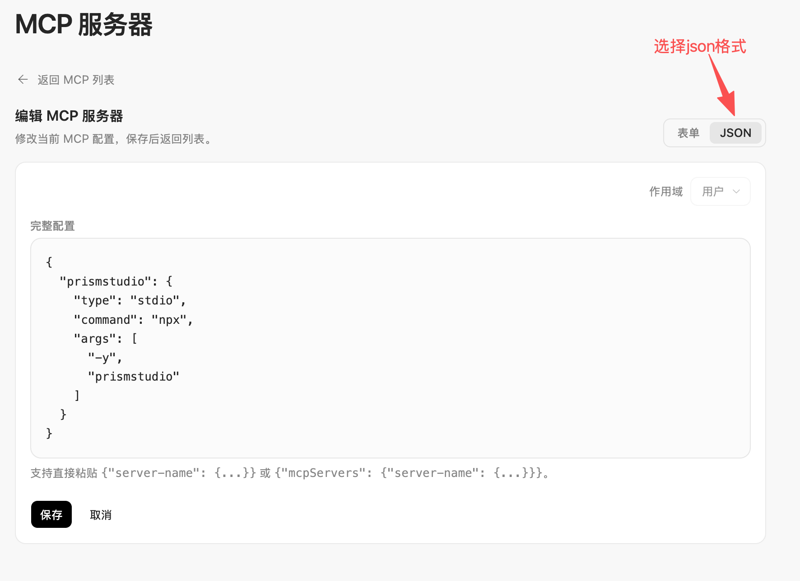

<div align="center">

# Prismstudio

**独立多模态生成 MCP Server** —— 一条命令，让任意 AI agent 生成图像 / 视频 / 音频

`图像 · 视频 · 音频` · `60 个预置模型` · `14 种协议` · `13 家厂商` · `内嵌 WebUI`

[](LICENSE)
[](package.json)
[](https://www.npmjs.com/package/prismstudio)
[](https://github.com/RunhuaHuang/prismstudio/actions/workflows/ci.yml)

**简体中文** ｜ [English](README.en.md)

</div>

<p align="center">
  
</p>

---

Prismstudio 是一个遵循 [Model Context Protocol](https://modelcontextprotocol.io) 的独立服务，让任意支持 MCP 的 AI agent（Claude Desktop、Cursor、Cline、Windsurf、VS Code 等）都能直接调用**几十个主流多模态模型**生成图像、视频、音频，而无需自己对接各家 API。

它把"配置麻烦"这件事用**内嵌 WebUI** 解决了：一条命令打开浏览器，选模型、填 Key、试用、一键复制接入配置，体验和桌面应用一样简单。

## 核心卖点

<table>
<tr>
<td width="50%" valign="top">

### 市面上主流模型，几乎全覆盖

**60 个预置模型 · 13 家厂商**，国内外一次接齐：

**🖼️ 图像** · OpenAI gpt-image · Google Gemini(nano-banana)/Vertex · 豆包 Seedream · 智谱 GLM-Image/CogView · 通义 Qwen-Image · 万相 · Stability · 腾讯混元 · MiniMax · Midjourney

**🎬 视频** · Google Veo 3.1 · 智谱 CogVideoX · 豆包 Seedance · 可灵 Kling · MiniMax · 万相 wan2.7 · Qwen HappyHorse · 腾讯混元

**🔊 音频** · CosyVoice · Qwen3-TTS · 智谱 GLM-TTS · MiniMax speech/music · 声音克隆

新模型？加一条预设即可，引擎自动分派 14 种协议族。

</td>
<td width="50%" valign="top">

### 一个 MCP，适配任意 agent

遵循开放 MCP 标准，**凡是支持 MCP 的本地 agent 都能直接接入**：

- **Claude Desktop**
- **Cursor**
- **Cline**
- **Windsurf**
- **VS Code (Copilot Chat)**
- … 以及任何 stdio MCP 客户端

接入零代码：WebUI 向导一键复制 `mcpServers` JSON，粘进 agent 配置即可。**写一次配置，所有 agent 共用。**

</td>
</tr>
</table>

### 还有这些

- **多模态全覆盖**：文生图、图生图/编辑、文生视频、图生视频、TTS 语音合成、音乐生成、声音克隆
- **内嵌 WebUI**：配置台、试用台、接入向导三合一，零配置门槛，不用手写 JSON
- **动态工具暴露**：只有配置好的模态才会暴露给 agent，不产生空壳工具
- **本地优先**：凭证明文存在本地 `~/.prismstudio/config.json`，WebUI 仅绑定 `127.0.0.1`，不上传任何数据

---

## 能力总览

Prismstudio 把「模态 × 厂商」封装成 14 种协议族，引擎内核按配置自动分派到对应 provider。当前共 **60 个预置模型**：

### 图像生成（28 个模型 / 文生图 · 图生图 · 编辑）

| 厂商 | 模型 | 能力 |
|---|---|---|
| OpenAI | gpt-image-1 / 2 | 文生图、参考图编辑、透明背景 |
| Google Gemini | flash / flash-lite / pro（nano-banana） | 文生图、多轮编辑、宽高比与分辨率 |
| Google Vertex | flash / flash-lite / pro | Gemini 同款，走 Vertex AI 配额 |
| 豆包 | Seedream（含 4 / 4.5 / 5 / 5-Lite） | 高质量国产图像 |
| 智谱 | GLM-Image、CogView-4 | 国产开源生态 |
| MiniMax | image-01 | 单图生成 |
| 通义万相 | Qwen-Image、Plus / Max / 2-Pro | 阿里云图像 |
| 万相 | wanx-2.1-turbo / plus | 高性价比 |
| Stability | SDXL / SD3 / Ultra | 经典 Stable Diffusion |
| 腾讯 | 混元 image v3 / lite | 腾讯云图像 |
| Midjourney | midjourney | 风格化生成 |

### 视频生成（19 个模型 / 文生视频 · 图生视频 · 异步）

| 厂商 | 模型 | 能力 |
|---|---|---|
| 智谱 | CogVideoX 2 / 3 / Flash | 国产开源视频 |
| 豆包 | Seedance（含 1.5-pro / 2 / 2-fast / 2-mini） | 字节视频 |
| 可灵 | Kling v2 | 高质量国产视频 |
| MiniMax | video-01 | 视频生成 |
| 万相 | wan2.7-t2v、wan2.7-videoedit | 文生视频、视频编辑 |
| 通义 | Qwen HappyHorse | 文/图/参考生视频 |
| 腾讯 | 混元 video v1.5 | 腾讯云视频 |
| Google Gemini | Veo 3.1 / 3.1-fast / 3.1-lite、Omni-flash | 国际顶级视频，支持音频 |
| Google Vertex | Omni-flash | Vertex 配额 |

### 音频生成（13 个模型 / TTS · 音乐 · 声音克隆）

| 厂商 | 模型 | 能力 |
|---|---|---|
| 智谱 | GLM-TTS、GLM-TTS-Clone | 语音合成、声音克隆 |
| 阿里 | CosyVoice | 通义语音合成 |
| 通义 | Qwen3-TTS（Flash / Instruct / 多方言） | 30+ 内置音色、方言 |
| MiniMax | speech-02 / async、music（含免费档/翻唱）、voice-clone | TTS、音乐生成、声音克隆 |

> 完整的预设 ID 与对应 `protocol`/`baseUrl`/`vendor` 见 [预设清单](#-配置文件说明) 或 `--webui` 配置台下拉。

---

## 系统要求

Prismstudio 是一个 Node.js MCP Server。macOS 和 Windows **默认不自带** Node.js / npm / npx；请先安装 **Node.js 20 或更高版本**。Node.js 官方安装包通常会同时安装 npm 与 npx。

### 检查是否已安装

```bash
node -v
npm -v
npx -v
```

如果 `node -v` 显示 `v20.x`、`v22.x` 或更高版本，就可以继续。

### 安装 Node.js

**macOS**

推荐任选一种：

```bash
# 官方安装包：下载并安装 LTS 版本
# https://nodejs.org/

# 或 Homebrew
brew install node

# 或 nvm
nvm install --lts
```

**Windows**

推荐任选一种：

```powershell
# 官方安装包：下载并安装 LTS 版本
# https://nodejs.org/

# 或 winget
winget install OpenJS.NodeJS.LTS
```

安装完成后，重新打开终端 / PowerShell，再运行上面的 `node -v`、`npm -v`、`npx -v` 检查。

---

## 快速开始

### 第 1 步：按需打开 WebUI 完成配置（推荐首次使用）

```bash
npx -y prismstudio@latest webui
```

浏览器会自动打开 `http://127.0.0.1:17899`。WebUI 是**按需配置面板，不是常驻服务**：

- 只有这条命令运行时才会占用 `17899` 端口
- 关掉终端或按 `Ctrl+C` 后，WebUI 会停止，不再占用电脑内存 / CPU
- 配置会保存到本地 `~/.prismstudio/config.json`，不会因为 WebUI 关闭而丢失
- 以后需要换模型、改 API Key、测试生成时，再运行同一条命令打开即可
- 设置好一次后，日常在 agent 里生成图片 / 视频 / 音频**不需要 WebUI 常驻**

在页面里：

1. **配置台**：为想用的模态（图片/视频/音频）选择预设模型、填写 API Key，点保存
2. **试用台**：直接生成一张图 / 一段 TTS 验证配置是否生效
3. **接入向导**：选择你的 agent，一键复制 `mcpServers` 配置 JSON

<p align="center">
  <strong>配置台</strong> · 选模型、填 Key、保存<br/>
  
</p>

<p align="center">
  <strong>试用台</strong> · 配好就试，所见即所得<br/>
  
</p>

<p align="center">
  <strong>接入向导</strong> · 选 agent，一键复制配置<br/>
  
</p>

### 第 2 步：接入到你的 agent

以 Claude Desktop 为例，编辑配置文件（macOS：`~/Library/Application Support/Claude/claude_desktop_config.json`）：

```json
{
  "mcpServers": {
    "prismstudio": {
      "command": "npx",
      "args": ["-y", "prismstudio@latest"]
    }
  }
}
```

保存 MCP 配置后，**请重启 Claude Desktop / Cursor / Cline / Windsurf 等 agent**，让它重新加载 MCP server。重启后，就能在对话中让 agent 生成图片、视频、音频了。

> 如果你的 agent 提供“表单 / JSON”切换，请选择 **JSON** 格式，把 WebUI 接入向导复制出的 JSON 粘贴进去。

<p align="center">
  <strong>MCP 配置填写提示</strong> · 选择 JSON 格式后粘贴配置<br/>
  
</p>

<details>
<summary><b>其他 agent 配置</b></summary>

**Cursor**（`~/.cursor/mcp.json`）：
```json
{
  "mcpServers": {
    "prismstudio": { "command": "npx", "args": ["-y", "prismstudio@latest"] }
  }
}
```

**Cline / Windsurf / VS Code**：同上结构，写入对应 MCP 配置位置即可。

**通用 stdio**：直接运行 `npx -y prismstudio@latest`，通过标准输入输出交互。

</details>

---

## 命令参考

```bash
prismstudio                       # 以 stdio MCP 模式运行（默认，供 agent 调用）
prismstudio webui                 # 启动本地 WebUI 配置台（等价于 --webui）
prismstudio --webui               # 启动本地 WebUI 配置台（浏览器打开 127.0.0.1:<port>）
prismstudio --webui --port 8080   # 指定 WebUI 端口（默认 17899）
prismstudio --output-dir <path>   # 覆盖生成物输出目录
prismstudio --version             # 显示版本号
prismstudio --help                # 显示帮助
```

**环境变量：**

| 变量 | 默认值 | 说明 |
|---|---|---|
| `PRISMSTUDIO_CONFIG` | `~/.prismstudio/config.json` | 指定配置文件路径（便于多套配置切换） |

---

## 提供的 MCP 工具

只有已配置好的模态才会暴露对应工具（动态工具暴露，避免给 agent 留下一堆用不了的空壳）：

| 工具 | 模态 | 能力 |
|---|---|---|
| `generate_image` | 图片 | 文生图、参考图编辑、多轮迭代优化 |
| `generate_video` | 视频 | 文生视频（异步，1-5 分钟）、图生视频 |
| `generate_audio` | 音频 | TTS 语音、音乐生成、声音克隆 |

每个工具支持丰富的厂商专属参数（如 OpenAI 的 `quality`/`background`、Gemini 的 `aspectRatio`/`imageSize`、Stability 的 `stylePreset`、视频的 `withAudio`/`frames` 等），详见各工具的 `inputSchema`。

**生成产物**会保存到 `<输出目录>/generated-media/`：
- 如果没有手动设置 `outputDir`，默认输出目录是 `~/.prismstudio/generated-media/`
- WebUI 试用台的临时试用产物默认保存在 `~/.prismstudio/playground/`
- 图片 / 音频同时以 base64 内联回传给 agent，便于直接预览
- 视频体积大，仅返回本地路径

> `~/.prismstudio` 是用户主目录下的隐藏文件夹（文件夹名前有一个点）。配置文件、默认生成产物和 WebUI 试用产物都会放在这里。

**如何查看隐藏文件夹：**

- **macOS Finder**：按 `Command + Shift + .` 显示/隐藏隐藏文件；或按 `Command + Shift + G`，输入 `~/.prismstudio` 后回车直接打开。
- **Windows 文件资源管理器**：点击“查看 / View” → “显示 / Show” → 勾选“隐藏的项目 / Hidden items”；也可以按 `Win + R`，输入 `%USERPROFILE%\.prismstudio` 后回车打开。

你也可以直接让 agent 帮你处理文件，例如：

> “请把刚才生成的视频复制到我的桌面。”
> “请把最新生成的图片移动到 `/Users/你的用户名/Downloads/作品/`。”

---

## 配置文件说明

配置文件位于 `~/.prismstudio/config.json`（可用 `PRISMSTUDIO_CONFIG` 覆盖）：

```jsonc
{
  "image": {
    "enabled": true,
    "presetId": "openai-gpt-image-2",  // 预设 ID，或 "custom" 手动指定
    "apiKey": "sk-...",                  // 明文存储
    "model": "...",                      // 可选，覆盖预设模型（仅 custom 必填）
    "protocol": "openai-images",         // 可选，仅 custom 时有意义
    "baseUrl": "..."                     // 可选，覆盖预设 endpoint
  },
  "video": { /* ... */ },
  "audio": { /* ... */ },
  "outputDir": "/path/to/out"           // 可选，生成物输出目录
}
```

> **同厂商 Key 记忆**：每个模态按厂商（vendor）单独记忆 API Key（存在 `apiKeyByVendor`，并兼容旧的 `apiKeyByPreset`）。同一模态内切换同厂商模型无需重填；图片 / 视频 / 音频三类工具之间不强制共用。

> **安全说明**：凭证以明文存储（与 MCP 生态惯例一致）。WebUI 仅绑定 `127.0.0.1`，不加载第三方 CDN 脚本/字体，并通过安全响应头、Origin / Sec-Fetch-Site 校验与 JSON Content-Type 校验降低本机跨站请求风险。生产环境请自行做好文件权限管控。详见 [SECURITY.md](SECURITY.md)。

---

## 本地开发

```bash
# 依赖
bun install

# 开发（直接跑 TS）
bun run dev              # stdio 模式
bun run dev:webui        # WebUI 模式

# 质量检查
bun run typecheck        # 类型检查
bun test                 # 测试套件
bun run build            # 构建到 dist/

# 测试 stdio 握手
echo '{"jsonrpc":"2.0","id":1,"method":"initialize","params":{"protocolVersion":"2024-11-05","capabilities":{},"clientInfo":{"name":"t","version":"1"}}}' | bun run dev
```

更多见 [CONTRIBUTING.md](CONTRIBUTING.md)。

---

## 架构

```
┌──────────────────────────────────────────────────┐
│  prismstudio（一个进程、一条命令）                     │
│                                                   │
│  ┌────────────────────────────────────────────┐  │
│  │  引擎内核（14 协议族，60 预置模型）           │  │
│  │  generateMedia() 统一入口                    │  │
│  └────────────────────────────────────────────┘  │
│            ▲                       ▲              │
│            │                       │              │
│   ┌────────┴───────┐      ┌────────┴─────────┐    │
│   │ stdio MCP 传输  │      │ 内嵌 HTTP WebUI  │    │
│   │ (给 agent 用)   │      │ (给人配置/试用)  │    │
│   └────────┬───────┘      └────────┬─────────┘    │
│            └───────┬────────────────┘             │
│         共享 ~/.prismstudio/config.json               │
└───────────────────────────────────────────────────┘
```

| 模块 | 职责 |
|---|---|
| `src/engine/media-generation-engine.ts` | 生成内核，按「模态 × 协议族」分派，裸 `fetch` 调用各 provider |
| `src/engine/google-auth.ts` | Google Vertex / Gemini 服务账号鉴权 |
| `src/config.ts` | 配置读写，把结构化配置转成引擎所需的 flat credentials |
| `src/persist.ts` | 生成产物落盘 + 构造 MCP content 块（纯 `node:fs`） |
| `src/mcp-server.ts` | 底层 Server + JSON Schema 注册工具，串联引擎/配置/落盘 |
| `src/index.ts` | CLI 入口，分流 stdio / `--webui` 两种模式 |
| `src/webui/server.ts` | HTTP server + REST API（仅 `127.0.0.1`） |
| `src/webui/index-html.ts` | Alpine.js 单文件页面（配置/试用台/接入向导） |

---

## License

[MIT](LICENSE) © Jacky Huang
